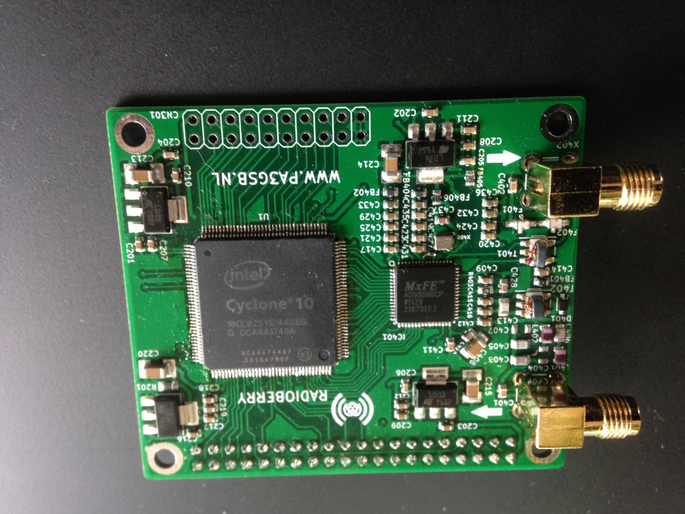
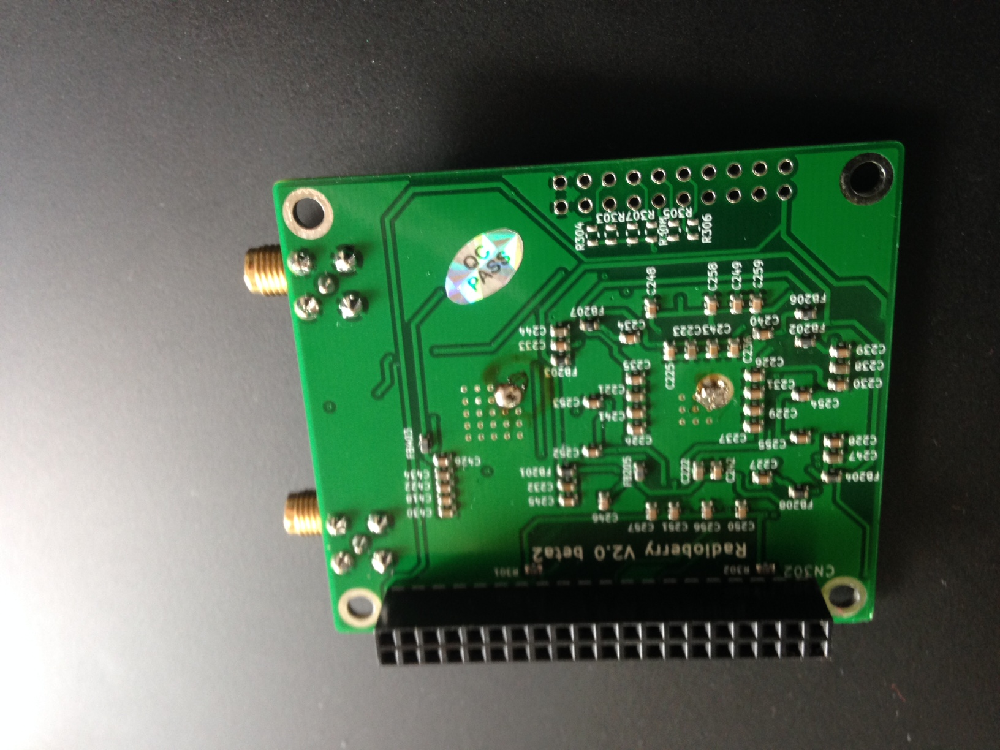
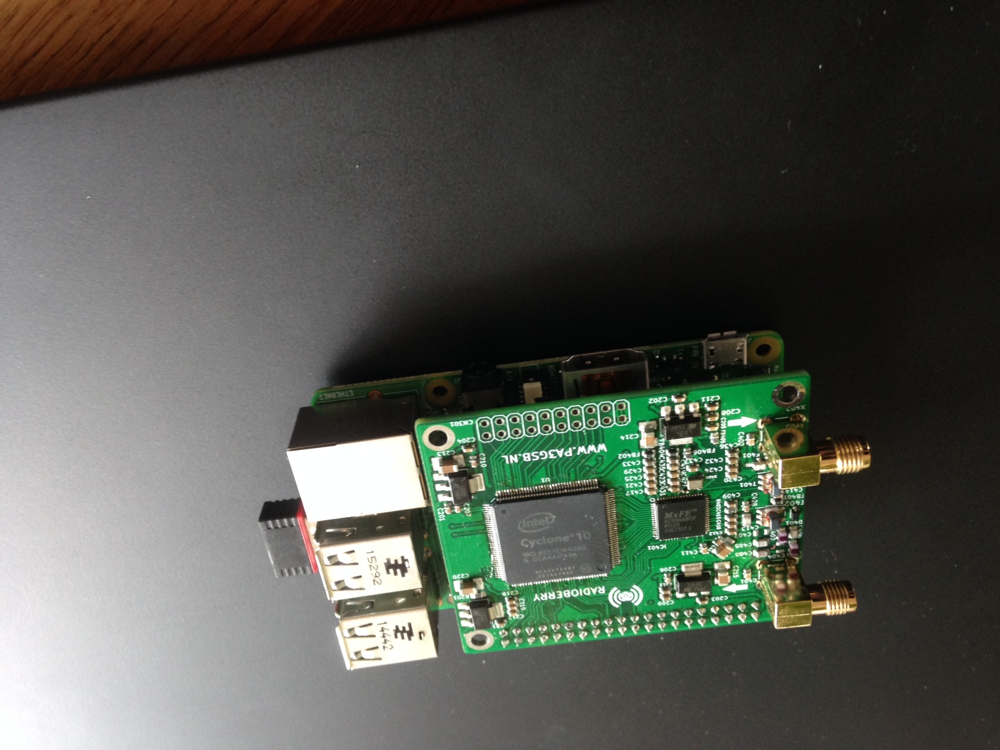
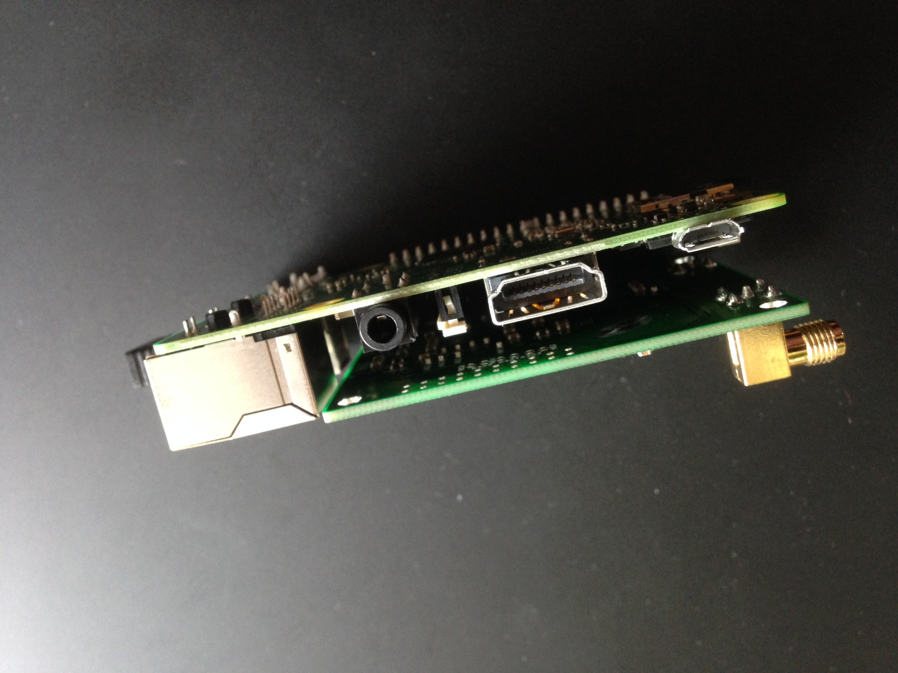
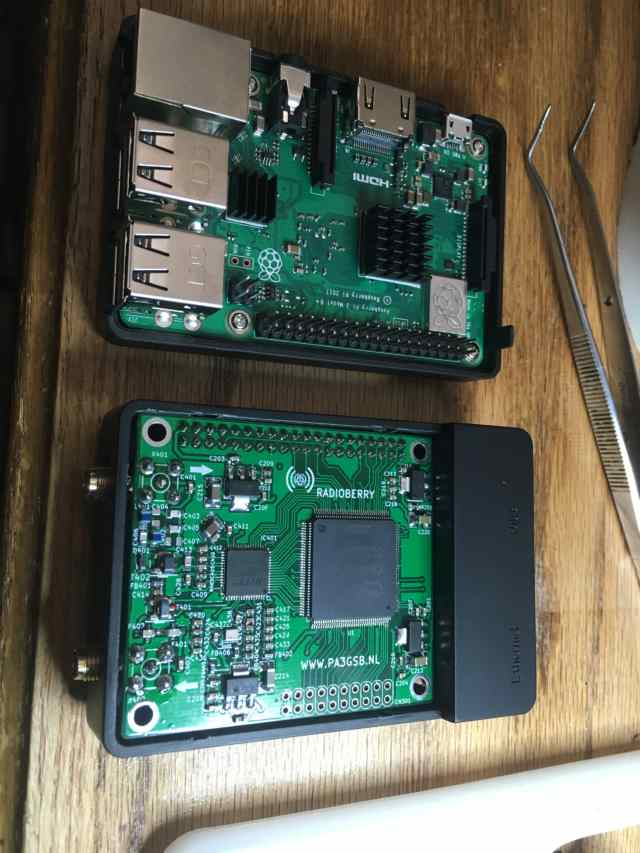

RadioBerry V2.0 - Ham radio cape for Raspberry PI
==============================================

## Main purpose of the project:

- Building a HAM Radio
- Learning (from noob to guru)

WIKI FOR MORE DETAILS:  https://github.com/pa3gsb/Radioberry-2.x/wiki

## Radioberry:

- Raspberry PI
- Radio extension board (cape)
	- using AD9866 (12 bit)  for RX and TX modes.

	
	
	
	
	
	
	

